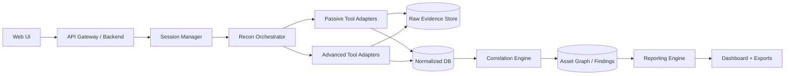
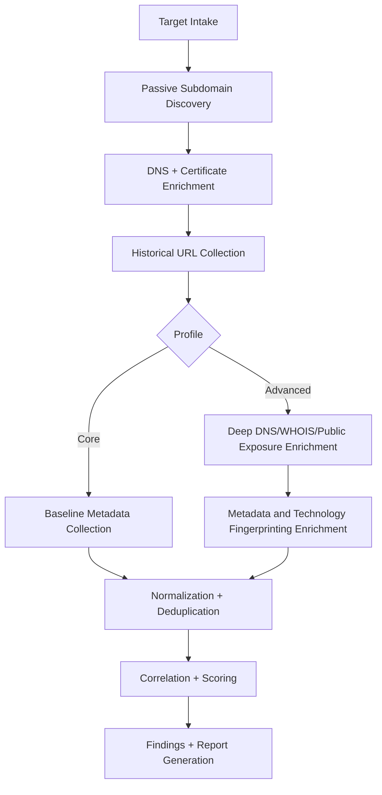
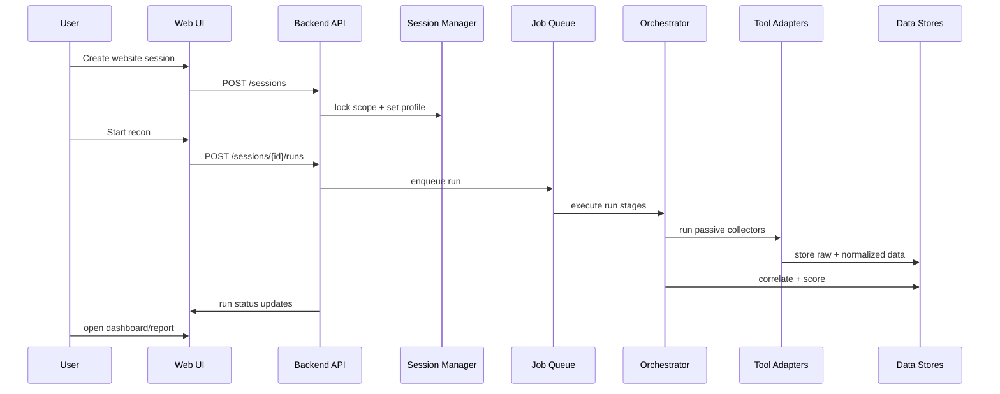

# 03. Architecture

## 1) High-Level Architecture

## 2) Core Components

1. **Frontend (Local Web App)**
   - Target management
   - Session creation and website switching
   - Job control and run history
   - Findings dashboard and report generation

2. **Backend API**
   - Auth/session control and scope locking
   - Job queue submission
   - Query endpoints for assets, findings, evidence, metrics

3. **Session Manager**
   - Creates isolated sessions per website/scope
   - Applies recon profile (core vs advanced)
   - Prevents cross-session data mixing

4. **Orchestrator**
   - Runs recon stages in deterministic order
   - Applies rate limits and provider policies
   - Tracks retries, run state, stage duration, and job logs

5. **Tool Adapter Layer**
   - One adapter per collector/provider
   - Converts output to canonical schema
   - Adds source metadata and parsing confidence

6. **Correlation + Scoring Engine**
   - Entity merge and dedupe
   - Cross-source confidence scoring
   - Finding prioritization

7. **Reporting Service**
   - Executive summary
   - Advanced-delta summary (what advanced mode added)
   - Technical detail appendix
   - Evidence traceability section

## 3) Pipeline Lifecycle

## 4) Sequence Diagram (Single Run)

## 5) Deployment Strategy

### Local First (Course Phase)

- Docker Compose services:
  - frontend
  - backend
  - worker
  - redis (queue)
  - postgres (primary data)
  - object store (optional for artifacts/screenshots)

### Future Online Phase

- Move services to managed cloud equivalents.
- Keep same interfaces and environment variables.
- Add reverse proxy, SSO, and monitoring stack.

## 6) Improvement Hooks

- Add plugin registry for new passive data providers.
- Add scheduled recurring recon and drift detection.
- Add team collaboration (comments, assignments, approvals).
- Add session templates (startup, enterprise, bug-bounty profile presets).

