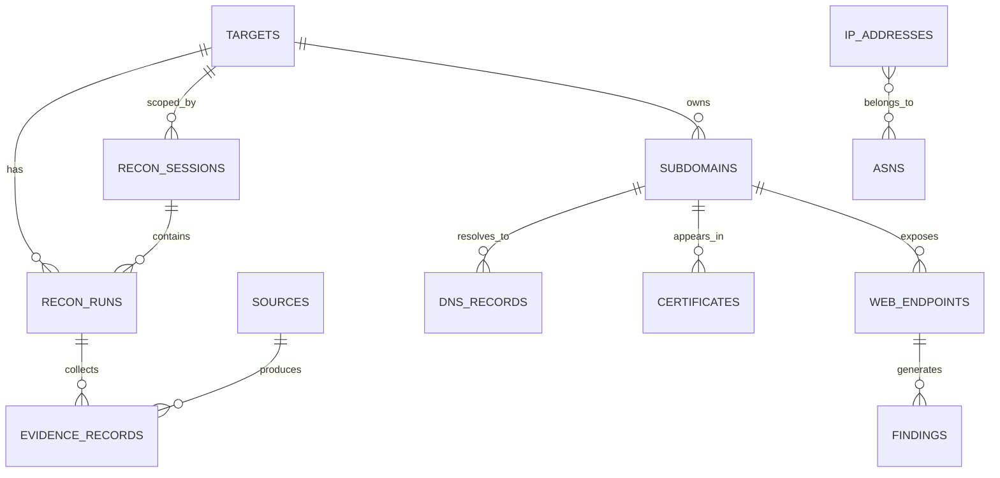

# 05. Data Model and Storage Design

## 1) Data Layers

1. **Raw Evidence Layer**: immutable ingestion records from each source/tool.
2. **Normalized Entity Layer**: deduplicated assets and metadata.
3. **Analytics Layer**: findings, scores, trends, and report aggregates.

## 2) Core Entities

- `targets`
- `recon_sessions`
- `recon_runs`
- `sources`
- `evidence_records`
- `domains`
- `subdomains`
- `dns_records`
- `certificates`
- `ip_addresses`
- `asns`
- `web_endpoints`
- `findings`

## 3) ER Diagram

## 4) Suggested Schema Notes

- Use UUID primary keys.
- Add `session_id` foreign key to all run-derived entities.
- Keep `first_seen` and `last_seen` timestamps on all observable entities.
- Store `source_count` and `confidence_score` as derived but persisted fields.
- Keep immutable JSON payload in `evidence_records.raw_payload`.
- Add profile metadata fields: `profile_id`, `is_advanced`, `stage_runtime_ms`.

## 5) Indexing Strategy

- Unique index on canonical host and target scope.
- Composite index: (`target_id`, `last_seen`) for timeline views.
- Composite index: (`session_id`, `target_id`, `last_seen`) for session-mode drill-down.
- Full text index for report search fields.

## 6) Session Isolation Rules

1. Every write operation must include `session_id`.
2. Session scope is immutable after session start (unless reopened with admin override).
3. Cross-session joins are blocked by default in API queries.
4. Cross-session analysis is generated through explicit compare endpoints only.

## 7) Confidence Scoring Model (Initial)

`confidence = source_diversity + recency + data_consistency - contradiction_penalty`

Example bands:
- 80-100: High confidence
- 50-79: Medium confidence
- 0-49: Low confidence

## 8) Data Retention

- Keep raw evidence for auditability.
- Allow configurable retention for large artifacts.
- Version scoring rules so old reports stay reproducible.
- Keep session snapshots so each website timeline is reviewable independently.

