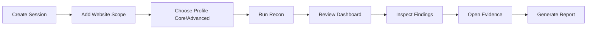

# 07. Reporting Web UI Design

## 1) UI Goals

- Fast understanding of target exposure
- Easy traceability from finding -> evidence
- Professional report generation with minimal manual editing
- Clean session isolation for different websites and scopes
- Clear highlighting of advanced-mode gains vs baseline mode

## 2) Main Screens

1. **Targets Page**
   - target list, status, tags, last run
2. **Session Manager**
   - create/select session, lock scope, choose profile
3. **Run Console**
   - current stage, logs, progress, failures/retries
4. **Dashboard**
   - total assets, new assets, confidence distribution, source coverage
5. **Assets Explorer**
   - subdomains, IPs, certs, endpoints with filters
6. **Findings Page**
   - severity/relevance cards with confidence and evidence links
7. **Report Builder**
   - template selection + export controls

## 3) User Flow

## 4) Dashboard Widgets

- Total discovered subdomains
- Newly discovered assets since previous run
- Top data sources by contribution
- Confidence score histogram
- High-priority finding summary
- Advanced profile delta widget (new assets found only in advanced mode)
- Time vs quality gain widget per stage

## 5) Report Output Structure

1. Executive Summary
2. Scope and Methodology
3. Session and Profile Summary
4. Key Findings
5. Detailed Evidence Appendix
6. Improvement Recommendations

## 6) Design Quality Rules

- Keep filters sticky and shareable (URL state).
- Preserve source links in every table row.
- Use consistent color scale for confidence/severity.
- Optimize print-ready report layout for PDFs.
- Always show session badge and scope lock state in header.

